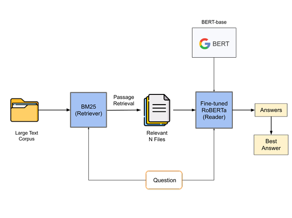
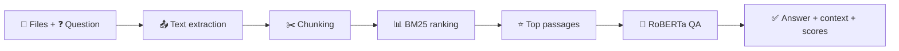

<div align="center">

# 📄 Document Retrieval QA

**Retrieval-augmented extractive QA** — rank passages with **BM25**, extract answers with **RoBERTa** (SQuAD&nbsp;2.0).

<p>
  <a href="https://www.python.org/"></a>
  &nbsp;
  <a href="https://gradio.app/"></a>
  &nbsp;
  <a href="https://huggingface.co/"></a>
</p>

<p>
  <a href="https://huggingface.co/IProject-10/roberta-base-finetuned-squad2">🤖 Model on Hub</a>
  &nbsp;·&nbsp;
  <a href="https://arxiv.org/pdf/1907.11692">📑 RoBERTa paper</a>
  &nbsp;·&nbsp;
  <a href="https://rajpurkar.github.io/SQuAD-explorer/">❓ SQuAD 2.0</a>
  &nbsp;·&nbsp;
  <a href="README.HuggingFace.md">🚀 Space README template</a>
</p>

</div>

---

## ✨ Highlights

| | |
|:--|:--|
| 📥 **Formats** | `.txt`, `.pdf` (text layer), `.docx` (paragraphs + tables) |
| 🔎 **Retrieval** | BM25 over overlapping chunks for long documents |
| 🧠 **Answering** | Extractive RoBERTa — grounded spans, not open-ended chat |
| 🖥️ **UI** | Gradio app; ready for **Hugging Face Spaces** |
| 🧩 **Code** | Split into small modules (`config`, `document_io`, `chunking`, `qa_model`, `answerer`, `ui`) |

---

## 🗺️ System flow

<p align="center">
  
</p>

<p align="center"><em>Pipeline: ingest → chunk → retrieve → answer → present context & scores</em></p>

<details>
<summary>🔁 Simplified schematic (Mermaid)</summary>



</details>

---

## 📋 Overview

This project is a **document QA** demonstration: upload documents, ask a question, receive an **answer span** backed by retrieved text — **not** a general-purpose chat bot.

🔹 Built as a college project, then tightened for readability, modularity, and deployment.

🔹 **Hugging Face Spaces:** paste **[`README.HuggingFace.md`](README.HuggingFace.md)** into your Space **README** (includes YAML card metadata Spaces expect).

---

## 🏗️ How it works (step by step)

1. **📄 Ingestion** — Plain text from TXT; PDF pages via pdfplumber; DOCX paragraphs and table rows.
2. **✂️ Chunking** — Long inputs are split with overlap so BM25 sees manageable passages.
3. **🔎 Retrieval** — `rank-bm25` scores each chunk vs. your query; top candidates move forward.
4. **🧠 Answering** — [`IProject-10/roberta-base-finetuned-squad2`](https://huggingface.co/IProject-10/roberta-base-finetuned-squad2) selects a span. The displayed result uses **QA confidence** first, **BM25** as a tiebreaker.

---

## 📁 Repository layout

| 📦 Module | 📝 Role |
|:----------|:--------|
| `app.py` | 🚪 Entry: logging, Gradio `demo`, `launch` |
| `config.py` | ⚙️ Model id, limits, allowed extensions |
| `document_io.py` | 📂 PDF / DOCX / TXT parsing |
| `chunking.py` | ✂️ Chunking + normalizing uploads |
| `qa_model.py` | 🤗 Tokenizer, model, QA pipeline |
| `answerer.py` | 🔗 BM25 + QA orchestration, highlighting |
| `ui.py` | 🖼️ Gradio layout and copy |

---

## ⚡ Quick start (local)

**Prerequisites:** Python **3.10+** · enough disk for PyTorch + transformers (CPU is OK).

```bash
git clone <your-repo-url>
cd DocumentRetrieval-QA-Application

python -m venv .venv
# ▶️ Windows:   .venv\Scripts\activate
# ▶️ macOS/Linux: source .venv/bin/activate

pip install -r requirements.txt
python app.py
```

Open the URL Gradio prints (usually `http://127.0.0.1:7860`). On Spaces, `app.py` binds to **`0.0.0.0:7860`**.

---

## 🚀 Deploying on Hugging Face Spaces

| Step | Action |
|:-----|:-------|
| 1️⃣ | Push this repo to a **Gradio Space** |
| 2️⃣ | Set **`app.py`** as the app file · keep **`requirements.txt`** |
| 3️⃣ | Copy **`README.HuggingFace.md`** into the Space README for the card + instructions |

💡 Enable a **GPU** Space if you want snappier loads and heavier traffic.

---

## ⚠️ Limitations

- **Extractive only** — answers must appear *in* your text; no invented citations.
- **PDFs** need a real text layer (scan + OCR is out of scope here).
- **Large uploads** mean more CPU time; split files or upgrade hardware if needed.

---

## 🎓 Academic context

Aligned with coursework on **encoder-based QA** and comparative build-outs of QA systems from pre-trained encoders (theme related to *Encoder-based LLMs: Building QA systems and Comparative Analysis*).

---

## 📜 License

Add your **`LICENSE`** file and optional badge here.

<!-- Example: [](LICENSE) -->
